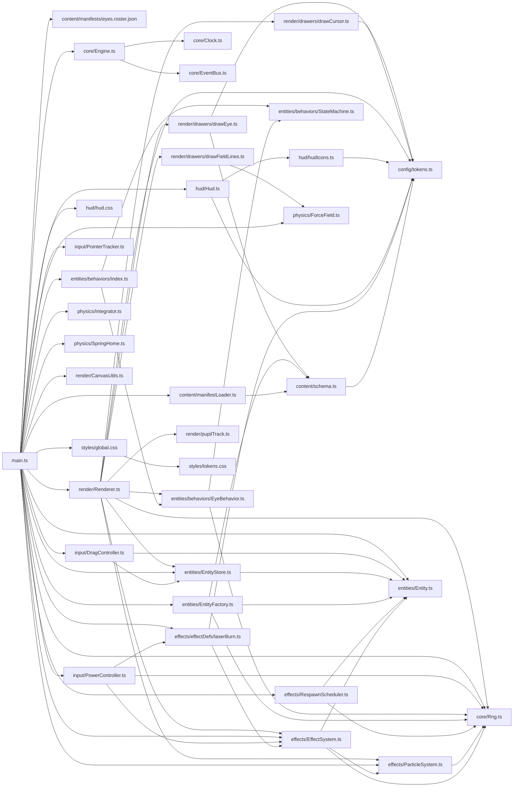

# Auto-extracted dependency graph

Generated from `src/main.ts` via `npx madge --ts-config ./tsconfig.json --extensions ts,tsx`.

## Module graph

## Adjacency (internal)

| From | → | To |
|------|---|----|
| `content/manifestLoader.ts` | → | `content/schema.ts` |
| `content/schema.ts` | → | `config/tokens.ts` |
| `core/Engine.ts` | → | `core/Clock.ts` |
| `core/Engine.ts` | → | `core/EventBus.ts` |
| `effects/EffectSystem.ts` | → | `core/Rng.ts` |
| `effects/EffectSystem.ts` | → | `effects/ParticleSystem.ts` |
| `effects/EffectSystem.ts` | → | `entities/Entity.ts` |
| `effects/ParticleSystem.ts` | → | `core/Rng.ts` |
| `effects/RespawnScheduler.ts` | → | `core/Rng.ts` |
| `effects/RespawnScheduler.ts` | → | `entities/Entity.ts` |
| `effects/effectDefs/laserBurn.ts` | → | `config/tokens.ts` |
| `effects/effectDefs/laserBurn.ts` | → | `effects/EffectSystem.ts` |
| `entities/EntityFactory.ts` | → | `content/schema.ts` |
| `entities/EntityFactory.ts` | → | `core/Rng.ts` |
| `entities/EntityFactory.ts` | → | `entities/Entity.ts` |
| `entities/EntityStore.ts` | → | `entities/Entity.ts` |
| `entities/behaviors/EyeBehavior.ts` | → | `core/Rng.ts` |
| `entities/behaviors/EyeBehavior.ts` | → | `entities/behaviors/StateMachine.ts` |
| `entities/behaviors/index.ts` | → | `entities/behaviors/EyeBehavior.ts` |
| `entities/behaviors/index.ts` | → | `entities/behaviors/StateMachine.ts` |
| `hud/Hud.ts` | → | `config/tokens.ts` |
| `hud/Hud.ts` | → | `hud/hudIcons.ts` |
| `hud/hudIcons.ts` | → | `config/tokens.ts` |
| `input/DragController.ts` | → | `entities/Entity.ts` |
| `input/DragController.ts` | → | `entities/EntityStore.ts` |
| `input/PowerController.ts` | → | `core/Rng.ts` |
| `input/PowerController.ts` | → | `effects/EffectSystem.ts` |
| `input/PowerController.ts` | → | `effects/effectDefs/laserBurn.ts` |
| `main.ts` | → | `content/manifestLoader.ts` |
| `main.ts` | → | `content/manifests/eyes.roster.json` |
| `main.ts` | → | `core/Engine.ts` |
| `main.ts` | → | `core/Rng.ts` |
| `main.ts` | → | `effects/EffectSystem.ts` |
| `main.ts` | → | `effects/ParticleSystem.ts` |
| `main.ts` | → | `effects/RespawnScheduler.ts` |
| `main.ts` | → | `effects/effectDefs/laserBurn.ts` |
| `main.ts` | → | `entities/Entity.ts` |
| `main.ts` | → | `entities/EntityFactory.ts` |
| `main.ts` | → | `entities/EntityStore.ts` |
| `main.ts` | → | `entities/behaviors/index.ts` |
| `main.ts` | → | `hud/Hud.ts` |
| `main.ts` | → | `hud/hud.css` |
| `main.ts` | → | `input/DragController.ts` |
| `main.ts` | → | `input/PointerTracker.ts` |
| `main.ts` | → | `input/PowerController.ts` |
| `main.ts` | → | `physics/ForceField.ts` |
| `main.ts` | → | `physics/Integrator.ts` |
| `main.ts` | → | `physics/SpringHome.ts` |
| `main.ts` | → | `render/CanvasUtils.ts` |
| `main.ts` | → | `render/Renderer.ts` |
| `main.ts` | → | `styles/global.css` |
| `render/Renderer.ts` | → | `config/tokens.ts` |
| `render/Renderer.ts` | → | `core/Rng.ts` |
| `render/Renderer.ts` | → | `effects/EffectSystem.ts` |
| `render/Renderer.ts` | → | `effects/ParticleSystem.ts` |
| `render/Renderer.ts` | → | `entities/EntityStore.ts` |
| `render/Renderer.ts` | → | `entities/behaviors/EyeBehavior.ts` |
| `render/Renderer.ts` | → | `render/drawers/drawCursor.ts` |
| `render/Renderer.ts` | → | `render/drawers/drawEye.ts` |
| `render/Renderer.ts` | → | `render/drawers/drawFieldLines.ts` |
| `render/Renderer.ts` | → | `render/pupilTrack.ts` |
| `render/drawers/drawCursor.ts` | → | `config/tokens.ts` |
| `render/drawers/drawEye.ts` | → | `config/tokens.ts` |
| `render/drawers/drawEye.ts` | → | `content/schema.ts` |
| `render/drawers/drawFieldLines.ts` | → | `physics/ForceField.ts` |
| `styles/global.css` | → | `styles/tokens.css` |

**Nodes**: 36 internal modules. **Edges**: 66 internal imports.

## Notes

- No circular dependencies (verified by `madge --circular`).
- `config/tokens.ts` is the locked-palette leaf — referenced by `drawCursor`, `drawEye`, `drawFieldLines` indirectly through HUD/icon files, and by `laserBurn`, `hud/Hud`, etc.
- `core/Rng.ts` is the only module that produces entropy; everything else takes a seeded `Rng` argument.
- `physics/ForceField.ts` is consumed by `render/drawers/drawFieldLines.ts` — the build-test enforces this single-source-of-truth invariant.
- `core/Engine.ts` reaches the widest: Clock, EventBus, Rng. It is the only object that owns the RAF loop.
- `render/Renderer.ts` is the second-widest fan-in (drawers + effects + entities + Rng + pupilTrack). It is the only object that draws to the canvas.
