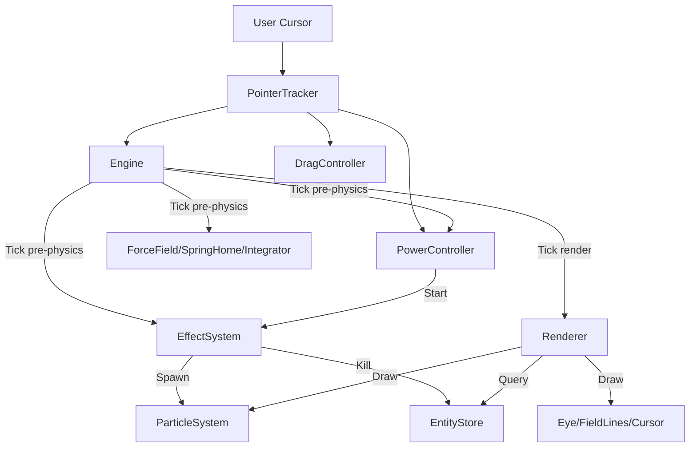

# Fun Satire — System Architecture & ADRs

## 1. Syntax & Conventions
- **Language**: TypeScript 5.x+, ES2022+ target.
- **Strictness**: `erasableSyntaxOnly` (no parameter properties/enums), `verbatimModuleSyntax` (explicit `import type`), `noUnusedLocals`.
- **Modularity**: Every module is a pure export; side effects are reserved exclusively for `src/main.ts`.
- **Immutability**: `Entity.content` is Readonly. State snapshots via `structuredClone` by default in `EntityStore.get()`.
- **Physics**: Semi-implicit Euler integration (`v += a*dt; p += v*dt`).

## 2. Architectural Decision Records (ADR)

### ADR 001: Component-as-Data (Registry Pattern)
- **Status**: Accepted.
- **Context**: The app must grow from v1 (eyes) to v3 (caricatures) without engine changes.
- **Decision**: Subjects are defined in JSON manifests. `renderType` and `rig` keys index into registries for behaviors and drawers.
- **Consequence**: Adding a new creature is purely additive (new behavior + drawer + registry entry).

### ADR 002: Shared Physics & Rendering Math (Single Source of Truth)
- **Status**: Accepted.
- **Context**: Visual field lines must match the real force field.
- **Decision**: `ForceField.ts` exports a pure `compute` and `sampleAlongRay`. `Integrator` and `drawFieldLines` both import this module.
- **Consequence**: Visuals never drift from the physical feel.

### ADR 003: Staged Effect System
- **Status**: Accepted.
- **Context**: Cathartic destruction effects need precise timing and easing.
- **Decision**: `EffectSystem` uses a staged timeline (`EffectDef`). Each stage has a duration and easing. `update(t)` advances through stage windows to handle time-jumps.
- **Consequence**: Complex effects like `laserBurn` are easily authored as pure data sequences.

### ADR 004: DOM HUD vs Canvas HUD
- **Status**: Accepted.
- **Context**: "Paper-cut" visual requires irregular edges and smooth type.
- **Decision**: Use DOM for the HUD (`Hud.ts`) with SVG masks for the torn-paper edge.
- **Consequence**: Optimal type rendering, accessibility (aria-labels), and GPU-safe transitions without per-frame canvas repaints for static UI.

### ADR 005: Mode-locked power pairing (v2)
- **Status**: Accepted — `docs/superpowers/specs/2026-07-25-fun-satire-v2-expansion-design.md` §2a.
- **Context**: v1 selected `HudMode` (crowd type) and `HudPower` (attack) independently via separate controls — `1`/`2`/`3` keyboard shortcuts bound to `switchPower()`, unrelated to the mode selector. This meant illegal-feeling combinations were reachable (e.g. `bugs` mode charging `laserBurn`).
- **Decision**: Each `HudMode` locks to exactly one `HudPower` (`eyes`→`laserBurn`, `pointedFinger`→`electricBurn`, `bugs`→`bugEat`), fixed at content-authoring time via a `Record<HudMode, HudPower>` lookup. The mode selector becomes the only power control; the power placard stays on screen as a read-only reflection, not a click target. The `1`/`2`/`3` keyboard listener and `switchPower()` are removed, not left as a redundant path.
- **Consequence**: Simpler player-facing model (one control instead of two), but it's a real UX reversal — reintroducing independent power selection later means undoing this removal, not just adding a control back. Nothing in the v2 spec's open questions proposes making the mapping player-configurable.

### ADR 006: Pairwise crowd separation as a deliberate `ForceField.ts` exception (v2)
- **Status**: Accepted — `docs/superpowers/specs/2026-07-25-fun-satire-v2-expansion-design.md` §4.
- **Context**: The v1-fix spec established a "never touch `Engine.ts`/`StateMachine.ts`/`EntityStore.ts`/`ForceField.ts`" discipline for registry-pattern extensions, to keep new content additive-only. v2's quantity/repel controls (§3) make crowd-member overlap visible and unacceptable at higher quantities or low repel strength, and cursor→entity repulsion (`ForceField.compute`) has no mechanism to prevent member-to-member overlap.
- **Decision**: `ForceField.ts` gains a pairwise minimum-separation term (`computeSeparation`/`accumulateSeparation`) — the one spec-mandated exception to the never-touch rule. Cost-bounded as O(n²), acceptable at v2's crowd sizes (tens, not hundreds); spatial partitioning is explicitly deferred as YAGNI until quantity ranges grow.
- **Consequence**: `ForceField.ts` is no longer strictly closed to extension — any future exception now has one precedent to point to, which raises the risk of the "never touch" rule eroding by accumulation. Enforced procedurally via the v2 orchestration plan's forbidden-files gate (`ForceField.ts` diff must be non-empty for this phase, and reviewed as the *only* sanctioned change to that file).

### ADR 007: Canvas + imperative TypeScript over HTMX
- **Status**: Accepted (v1, retroactively documented).
- **Context**: The original project brief asked for an explicit architecture/stack decision between HTMX and JavaScript. The core mechanic is a 60fps physics simulation — a crowd of entities integrated every frame (position/velocity from cursor-driven force fields) and rendered continuously.
- **Decision**: Vite + TypeScript + Canvas, with all rendering and physics driven by an in-process `requestAnimationFrame` loop (`Engine.ts`). HTMX was rejected: its model is server-round-trip-driven DOM swaps, which cannot deliver sub-frame-latency, client-side control over a continuously-integrated physics loop.
- **Consequence**: The entire engine/physics/render pipeline runs client-side with no server round-trips on the interaction path; the DOM is reserved for the HUD only (see ADR 004), not for entity rendering.

### ADR 008: Content guardrail — schema-enforced `styleGuardrail: 'flat-illustrated'`
- **Status**: Accepted (v1, retroactively documented).
- **Context**: v3's real-figure roster (ministers, CJI, national agencies, Godi Media hosts/logos) carries likeness/defamation risk if rendered photoreal or as doctored real photographs. The project needs a durable rule, not a one-off spec note, since it governs every subject added from v1 onward.
- **Decision**: Every subject manifest must declare `visual.styleGuardrail: 'flat-illustrated'`; manifest validation (`content/schema.ts`, `content/manifestLoader.ts`) rejects any entry missing or misusing it. This is a structural authoring-pipeline/schema gate, not a runtime image-content check — the guarantee comes from what's allowed into a manifest, not from inspecting pixels.
- **Consequence**: All subjects, including any future real-figure caricatures, are constrained to flat, paper-craft-style, satirical illustration — never photoreal, never doctored photos, no hate iconography. Adding a subject that violates this fails validation before it can render.

## 3. Core Definitions

| Term | Definition |
|---|---|
| **Entity** | A discrete interactive subject (Eye, Finger). Consists of identity (Content), physical state (Physics), and behavior (StateMachine). |
| **Power** | A user-armed tool (Laser Burn). Tracks charge/cooldown; triggers an Effect. |
| **Effect** | A visual sequence (Particle burst, Scale shrink) mapped to an Entity's lifecycle. |
| **ForceField** | The cursor-driven repulsion/attraction field math. |
| **Integrator** | The physics step that updates Position/Velocity from Acceleration. |
| **Registry** | A map of string IDs to Drawer or Behavior factories. |

## 4. System Relationships (Data Flow)

