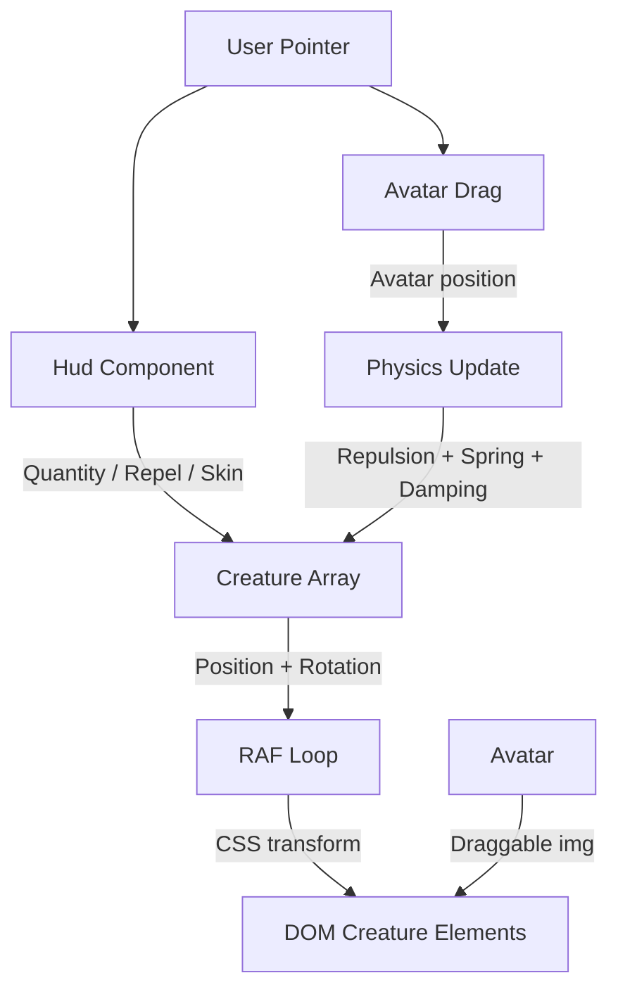

# Fun Satire — System Architecture & ADRs

## 1. Syntax & Conventions
- **Language**: TypeScript 5.x+, ES2022+ target.
- **Strictness**: `erasableSyntaxOnly` (no parameter properties/enums), `verbatimModuleSyntax` (explicit `import type`), `noUnusedLocals`.
- **Modularity**: Every module is a pure export; side effects are reserved exclusively for `src/main.ts`.
- **Physics**: Semi-implicit Euler integration (`v += a*dt; p += v*dt`).

## 2. Architectural Decision Records (ADR)

### ADR 001: Component-as-Data (Registry Pattern)
- **Status**: Superseded — replaced by DOM-first creature rendering (ADR 011).
- **Context**: The app must grow from v1 (eyes) to v3 (caricatures) without engine changes.
- **Decision**: Subjects were defined in JSON manifests. `renderType` and `rig` keys indexed into registries for behaviors and drawers.
- **Consequence**: Superseded by the simplified DOM-first approach where creatures are plain objects in an array, rendered as DOM elements.

### ADR 002: Shared Physics Math (Single Source of Truth)
- **Status**: Accepted (updated).
- **Context**: Creature motion must feel consistent and visually match the force model.
- **Decision**: A single physics module computes repulsion from the draggable avatar, spring-toward-home attraction, and velocity damping. All creature updates use the same force calculation.
- **Consequence**: Visuals never drift from the physical feel. Simpler than the previous multi-force-field model — one repulsion source, one spring target per creature, uniform damping.

### ADR 003: Staged Effect System
- **Status**: Deferred.
- **Context**: Cathartic destruction effects need precise timing and easing.
- **Decision**: `EffectSystem` used a staged timeline (`EffectDef`). Each stage had a duration and easing.
- **Consequence**: Deferred — the simplified architecture removes burn/destroy effects pending future re-introduction.

### ADR 004: DOM HUD
- **Status**: Accepted (updated).
- **Context**: UI controls need smooth type, accessibility, and GPU-safe transitions.
- **Decision**: A single consolidated `Hud.ts` component owns all UI: mode selector, skin gallery, quantity/repel sliders. Popover for filters, slide-in panel for gallery.
- **Consequence**: Optimal type rendering, accessibility (aria-labels), and GPU-safe transitions. All HUD logic in one component instead of 18+ scattered files.

### ADR 005: Mode-locked power pairing (v2)
- **Status**: Deferred.
- **Context**: v2 design locked each HudMode to exactly one HudPower.
- **Decision**: Each `HudMode` would lock to exactly one `HudPower` via a fixed lookup.
- **Consequence**: Deferred — powers subsystem is not part of the simplified architecture.

### ADR 006: Pairwise crowd separation
- **Status**: Deferred.
- **Context**: v2's quantity/repel controls made crowd-member overlap visible at higher quantities.
- **Decision**: `ForceField.ts` would gain a pairwise minimum-separation term.
- **Consequence**: Deferred — the simplified physics model uses uniform repulsion from the avatar without pairwise separation.

### ADR 007: Canvas + imperative TypeScript over HTMX
- **Status**: Superseded — replaced by DOM-first creature rendering (ADR 011).
- **Context**: The original project brief asked for an architecture/stack decision between HTMX and JavaScript.
- **Decision**: Vite + TypeScript + Canvas, with all rendering driven by a `requestAnimationFrame` loop.
- **Consequence**: Superseded. Creatures are now DOM elements (div + img/svg) positioned via CSS transforms in a RAF loop. HTMX remains rejected for the same reasons. The DOM is now used for both creatures and HUD.

### ADR 008: Content guardrail — schema-enforced `styleGuardrail: 'flat-illustrated'`
- **Status**: Deferred.
- **Context**: v3's real-figure roster carries likeness/defamation risk if rendered photoreal.
- **Decision**: Every subject manifest would declare `visual.styleGuardrail: 'flat-illustrated'`.
- **Consequence**: Deferred — content manifest system is not part of the simplified architecture.

### ADR 009: Curated avatar sticker guardrail
- **Status**: Deferred.
- **Context**: Avatar image pipeline needed likeness/defamation safeguards.
- **Decision**: `styleGuardrail` would admit `curated-avatar` alongside `flat-illustrated` with a registered `assetId`.
- **Consequence**: Deferred — content manifest system is not part of the simplified architecture.

### ADR 010: Multi-subject targeting (PR2)
- **Status**: Superseded — replaced by draggable avatar model (ADR 011).
- **Context**: PR2 needed N subjects coexisting with distributed gaze and tap-to-lock targeting.
- **Decision**: A `Map<EntityId, SubjectRecord>` collection with a `lockedSubjectId` pointer for power delivery.
- **Consequence**: Superseded. The repulsion source is now a single draggable avatar (Tax Tai PNG), not a subject collection. Creatures face away from the avatar via `atan2 + 180°` rotation.

### ADR 011: DOM-first creature rendering
- **Status**: Accepted.
- **Context**: Canvas rendering required a full engine/physics/render pipeline with drawers, ImageAssetCache, and per-frame canvas repaints for every creature. The creature count is small (tens, not hundreds), making DOM viable and simpler.
- **Decision**: Creatures are rendered as DOM elements (div containers with img or svg children). Position and rotation are applied via CSS `transform: translate() rotate()`. A lightweight RAF loop updates transforms directly — no virtual DOM, no framework. The Entity/EntityStore/EntityFactory ECS is replaced by a simple array of creature objects.
- **Consequence**: Eliminates the entire `render/` module (Renderer, CanvasUtils, drawers), the ECS layer (Entity, EntityFactory, EntityStore, StateMachine), and the content manifest pipeline. Adding a new creature type means adding a new creature factory function, not a new drawer + behavior + registry entry.

### ADR 012: Simplified physics (repulsion + spring + damping)
- **Status**: Accepted.
- **Context**: The previous physics model had multiple force fields, SpringHome per-entity, LookAt toward cursor/subject, and pairwise separation — four interacting subsystems. The simplified architecture needs creatures to flee from a draggable avatar and return home when undisturbed.
- **Decision**: Three forces, computed per-creature per-frame: (1) repulsion from the draggable avatar position, (2) spring attraction toward each creature's home position, (3) velocity damping. Rotation is `atan2(creature - avatar) + 180°` so creatures face away from the avatar. No pairwise separation, no multi-target gaze, no cursor-driven force fields.
- **Consequence**: Physics is a single function with three terms. No ForceField.ts, no Integrator.ts, no SpringHome.ts, no LookAt.ts as separate modules — consolidated into one physics update. Easier to reason about, test, and tune.

### ADR 013: Consolidated HUD component
- **Status**: Accepted.
- **Context**: The v1 HUD was spread across 18+ files (Hud.ts, mode/skin/quantity/repel controls, OverlayLayout, multiple panel components). This made HUD changes require touching many files.
- **Decision**: A single `Hud.ts` component owns all UI state and rendering. Filter UI uses a popover pattern. Skin/creature gallery uses a slide-in panel. No OverlayLayout or separate panel components.
- **Consequence**: All HUD logic in one file. Adding a control means editing Hud.ts, not creating a new component + wiring it into a layout. Trade-off: Hud.ts will grow larger, but it stays cohesive since all UI concerns are inherently coupled.

## 3. Core Definitions

| Term | Definition |
|---|---|
| **Creature** | A simple object with position, velocity, home position, rotation, and visual config. Rendered as a DOM element. |
| **Avatar** | The draggable repulsion source (Tax Tai PNG). Creatures flee from its position. |
| **Physics** | Single update function: repulsion from avatar + spring toward home + velocity damping. |
| **Hud** | Consolidated DOM component owning all UI: mode, skin gallery, quantity, repel controls. |
| **Home position** | Each creature's rest position. Spring force pulls creatures back when avatar moves away. |

## 4. System Relationships (Data Flow)

